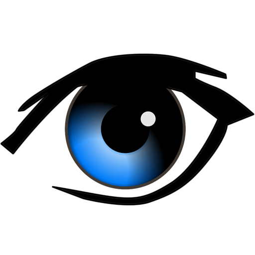

# ioBroker.agent-dvr

**Tests:** 

## agent-dvr Adapter für ioBroker

Verbindet ioBroker mit [AgentDVR](https://www.ispyconnect.com): Kameras und Mikrofone werden automatisch erkannt, alle Gerätewerte als Datenpunkte gespiegelt, Steuerbefehle (Aufnahme, Arm/Disarm, PTZ, …) als Buttons bereitgestellt und neue Aufnahmen per Push-Trigger sofort gemeldet. Pro Kamera wird eine responsive HTML-Galerie mit optionalem Such- und Tag-Filter erzeugt.

## Funktionen

- Automatische Erkennung aller AgentDVR-Kameras und -Mikrofone beim Start
- Alle Geräteeigenschaften als flache Datenpunkte (aus der API gespiegelt)
- Steuerbuttons pro Gerät: Aufnahme, Snapshot, Erkennung, Alarm ein/aus, Gerät ein/aus, Objekterkennung, Ordner leeren, …
- Systemweite Buttons: Arm, Disarm, alle ein/aus, Konfiguration neu laden, Speicherverwaltung, Neustart, …
- **Profil-Selektor** — beschreibbarer Dropdown mit dem aktuell aktiven AgentDVR-Profil (Home / Away / Night / benutzerdefiniert); Änderungen werden sofort übernommen
- **Snapshot als Base64** — State `snapshot_b64` (Rolle `media.picture`) pro Kamera, manuell per Button abrufbar oder automatisch bei jedem Poll aktualisiert
- PTZ-Steuerung mit Hold-Switches (links, rechts, oben, unten, Diagonalen, Zoom ein/aus, Stop, Mitte)
- Stream-URLs pro Kamera (Snapshot, Foto, MJPEG, MP4)
- Push-Trigger — ioBroker-Skripte reagieren sofort wenn AgentDVR eine neue Aufnahme meldet
- HTML-Galerie-Widget pro Kamera (reines HTML/CSS oder JS-Modus mit Suche und Tag-Filter)
- Übersichts-Widget mit allen Kameras in einem HTML-State
- Rohdaten-JSON-State für fortgeschrittene Anwendungsfälle

## Konfiguration

| Einstellung | Beschreibung | Standard |
|-------------|-------------|---------|
| AgentDVR IP | IP-Adresse des AgentDVR-Servers | — |
| Port | AgentDVR-Port | `8090` |
| Benutzername / Passwort | Optionale HTTP-Basic-Authentifizierung | — |
| Abfrageintervall (s) | Wie oft Daten von AgentDVR abgerufen werden | `30` |
| HTTP-Timeout (ms) | Timeout pro API-Anfrage | `8000` |
| Systemsteuerungs-Buttons | Arm/Disarm/Neustart/…-Buttons und Profil-Selektor anlegen | `true` |
| PTZ-Steuerungs-Buttons | PTZ Hold-Switches pro Kamera anlegen | `true` |
| Stream-URLs erzeugen | URL-States (Snapshot, MJPEG, MP4) pro Kamera anlegen | `true` |
| Snapshot als Base64 | Aktuelles Kamerabild bei jedem Poll als Base64 speichern | `false` |
| Ereignis-Datenpunkte | Aufnahme-Metadaten spiegeln (letztes Ereignis, Anzahl, …) | `true` |
| Echtzeit-Push-Trigger | Push-Trigger-State anlegen, auf den Skripte subscriben können | `true` |
| Übersichts-Widget | Einzelner HTML-State mit allen Kamera-Live-Kacheln | `true` |
| Galerie-Widget pro Kamera | HTML-Aufnahmegalerie pro Kamera | `true` |
| Roh-API-JSON speichern | Die vollständige getObjects-Antwort in `system.raw_getObjects` schreiben | `false` |

## Datenpunkte

Der Adapter erzeugt folgende Datenpunkt-Struktur. `<cam>` steht für `cam_<oid>_<name>`, z.B. `cam_8_Reolink`. Mikrofone verwenden dasselbe Layout mit Präfix `mic_<oid>_<name>`.

### System

| Datenpunkt | Typ | R/W | Beschreibung |
|-----------|-----|-----|-------------|
| `system.online` | boolean | R | Verbindung zu AgentDVR hergestellt |
| `system.lastUpdate` | string | R | ISO-Zeitstempel der letzten erfolgreichen Abfrage |
| `system.lastPoll` | number | R | Unix-Zeitstempel der letzten Abfrage |
| `system.cameraCount` | number | R | Anzahl erkannter Kameras |
| `system.disk_free_gb` | number | R | Freier Speicherplatz in GB |
| `system.settings.*` | verschiedene | R | Flache AgentDVR-Servereinstellungen |
| `system.stats.*` | verschiedene | R | CPU / RAM / Festplatten-Statistiken |
| `system.status.*` | verschiedene | R | Systemstatus (armed, Geräteanzahl, Version, …) |
| `system.raw_getObjects` | string | R | Roh-getObjects-JSON (wenn aktiviert) |

### Systemsteuerung *(erfordert „Systemsteuerungs-Buttons")*

| Datenpunkt | Typ | R/W | Beschreibung |
|-----------|-----|-----|-------------|
| `system.control.arm` | Button | W | System scharf schalten |
| `system.control.disarm` | Button | W | System unscharf schalten |
| `system.control.allOn` | Button | W | Alle Geräte einschalten |
| `system.control.allOff` | Button | W | Alle Geräte ausschalten |
| `system.control.reloadConfig` | Button | W | AgentDVR-Konfiguration neu laden |
| `system.control.reloadObjects` | Button | W | Objekte neu laden |
| `system.control.runStorageMgmt` | Button | W | Speicherverwaltung ausführen |
| `system.control.blockExternal` | Button | W | Externen Zugriff sperren |
| `system.control.unblockExternal` | Button | W | Externen Zugriff freigeben |
| `system.control.restart` | Button | W | AgentDVR neu starten |
| `system.control.refresh` | Button | W | Sofortige Abfrage erzwingen |
| `system.profile.selector` | number | R/W | Aktiver Profil-Index — Dropdown aus AgentDVR befüllt (0 = Home, 1 = Away, …); aktives Profil wird bei jedem Poll aktualisiert |
| `system.profile.list` | string | R | Verfügbare Profile als JSON-Array |

### Pro Kamera / Mikrofon

Die rohen Gerätedaten aus AgentDVR werden rekursiv gespiegelt (Tiefe konfigurierbar, Standard 6). Der wichtigste Unterordner ist `<cam>.data.*`:

| Datenpunkt | Typ | R/W | Beschreibung |
|-----------|-----|-----|-------------|
| `<cam>.name` | string | R | Gerätename |
| `<cam>.data.online` | boolean | R | Gerät ist online |
| `<cam>.data.connected` | boolean | R | Stream ist verbunden |
| `<cam>.data.recording` | boolean | R | Aufnahme läuft gerade |
| `<cam>.data.detected` | boolean | R | Bewegung/Objekt erkannt |
| `<cam>.data.detectorActive` | boolean | R | Bewegungsdetektor aktiv |
| `<cam>.data.alertsActive` | boolean | R | Alarm aktiviert |
| `<cam>.data.alerted` | boolean | R | Alarm wird gerade ausgelöst |
| `<cam>.data.scheduleActive` | boolean | R | Zeitplan aktiv |
| `<cam>.data.width` / `height` | number | R | Stream-Auflösung |
| `<cam>.data.*` | verschiedene | R | Alle weiteren Geräteeigenschaften aus AgentDVR |
| `<cam>.snapshot_b64` | string | R | Aktuelles Kamerabild als `data:image/jpeg;base64,…` (Rolle `media.picture`) |
| `<cam>.control.record` | Button | W | Aufnahme starten |
| `<cam>.control.recordStop` | Button | W | Aufnahme stoppen |
| `<cam>.control.recordRestart` | Button | W | Aufnahme neu starten |
| `<cam>.control.triggerRecord` | Button | W | Aufnahme auslösen (läuft bis Timeout) |
| `<cam>.control.snapshot` | Button | W | AgentDVR einen Snapshot auf Disk speichern lassen |
| `<cam>.control.refreshSnapshotB64` | Button | W | Aktuelles Bild abrufen und in `snapshot_b64` schreiben |
| `<cam>.control.detect` | Button | W | Bewegungserkennung auslösen |
| `<cam>.control.alertOn` | Button | W | Alarm aktivieren |
| `<cam>.control.alertOff` | Button | W | Alarm deaktivieren |
| `<cam>.control.switchOn` | Button | W | Gerät einschalten |
| `<cam>.control.switchOff` | Button | W | Gerät ausschalten |
| `<cam>.control.objectDetectOn` | Button | W | Objekterkennung aktivieren |
| `<cam>.control.objectDetectOff` | Button | W | Objekterkennung deaktivieren |
| `<cam>.control.recOnAlert` | Button | W | „Aufnahme bei Alarm" aktivieren |
| `<cam>.control.recOnDetect` | Button | W | „Aufnahme bei Erkennung" aktivieren |
| `<cam>.control.purge` | Button | W | Alle Aufnahmen im Geräteordner löschen |

### PTZ *(nur Kameras, erfordert „PTZ-Steuerungs-Buttons")*

| Datenpunkt | Typ | R/W | Beschreibung |
|-----------|-----|-----|-------------|
| `<cam>.control.ptz.left` | Switch | R/W | Nach links schwenken (halten = Dauerbewegung) |
| `<cam>.control.ptz.right` | Switch | R/W | Nach rechts schwenken |
| `<cam>.control.ptz.up` | Switch | R/W | Nach oben neigen |
| `<cam>.control.ptz.down` | Switch | R/W | Nach unten neigen |
| `<cam>.control.ptz.upLeft` | Switch | R/W | Diagonal oben-links |
| `<cam>.control.ptz.upRight` | Switch | R/W | Diagonal oben-rechts |
| `<cam>.control.ptz.downLeft` | Switch | R/W | Diagonal unten-links |
| `<cam>.control.ptz.downRight` | Switch | R/W | Diagonal unten-rechts |
| `<cam>.control.ptz.zoomIn` | Switch | R/W | Reinzoomen |
| `<cam>.control.ptz.zoomOut` | Switch | R/W | Rauszoomen |
| `<cam>.control.ptz.stop` | Button | W | PTZ-Bewegung stoppen |
| `<cam>.control.ptz.center` | Button | W | In Mittelposition/Home fahren |

### Stream-URLs *(nur Kameras, erfordert „Stream-URLs erzeugen")*

| Datenpunkt | Typ | R/W | Beschreibung |
|-----------|-----|-----|-------------|
| `<cam>.urls.snapshot` | string | R | URL zum aktuellen JPEG-Snapshot (`/grab.jpg`) |
| `<cam>.urls.photo` | string | R | URL zum Foto-Endpoint (`/photo.jpg`) |
| `<cam>.urls.mjpeg` | string | R | URL zum MJPEG-Livestream (`/video.mjpg`) |
| `<cam>.urls.mp4` | string | R | URL zum MP4-Livestream (`/video.mp4`) |

### Ereignisse / Galerie *(nur Kameras)*

| Datenpunkt | Typ | R/W | Beschreibung |
|-----------|-----|-----|-------------|
| `<cam>.events.*` | verschiedene | R | Metadaten der letzten Aufnahme (Dateiname, Datum, Dauer, Tags, …) — erfordert „Ereignis-Datenpunkte" |
| `<cam>.push` | string | R | Push-Trigger — wird sofort aktualisiert wenn AgentDVR eine neue Aufnahme meldet — erfordert „Echtzeit-Push-Trigger" |
| `<cam>.gallery` | string | R | HTML-Galerie der letzten Aufnahmen — erfordert „Galerie-Widget" |

### Übersicht *(erfordert „Übersichts-Widget")*

| Datenpunkt | Typ | R/W | Beschreibung |
|-----------|-----|-----|-------------|
| `overview` | string | R | HTML-Kachelraster aller Kameras mit Livestream-Links |

## Snapshot als Base64

Der State `snapshot_b64` enthält das aktuelle Kamerabild als `data:image/jpeg;base64,…`-String und kann direkt in vis/vis-2-Bild-Widgets verwendet werden, ohne dass der Browser einen eigenen HTTP-Request durchführen muss.

**Manuell aktualisieren:** `true` in `<cam>.control.refreshSnapshotB64` schreiben — kein Adapter-Neustart nötig.

**Automatisch aktualisieren:** „Snapshot als Base64" in den Adapter-Einstellungen aktivieren — dann wird der State bei jedem Poll-Zyklus neu befüllt.

## Changelog

<!--
	Placeholder for the next version (at the beginning of the line):
	### **WORK IN PROGRESS**
-->
### 0.0.4 (2026-06-27)
* (ipod86) fix: DP-Rollen korrigiert: snapshot_b64 → state (E1008), Profil-Selektor → level (E1011)

### 0.0.3 (2026-06-27)
* (ipod86) feat: Profil-Selektor — liest Profile aus getObjects, beschreibbarer Dropdown mit aktivem Profil bei jedem Poll
* (ipod86) feat: snapshot_b64-State (media.picture) immer vorhanden + manueller Refresh-Button; Auto-Poll optional

### 0.0.2 (2026-06-27)
* (ipod86) npm Trusted Publishing eingerichtet und Repochecker-Findings behoben

### 0.0.1 (2026-06-27)
* (ipod86) Erstveröffentlichung

[Ältere Changelog-Einträge in CHANGELOG_OLD.md](CHANGELOG_OLD.md)

## Lizenz
MIT License

Copyright (c) 2026 ipod86 <david@graef.email>

Hiermit wird unentgeltlich jeder Person, die eine Kopie der Software und der zugehörigen Dokumentationen (die „Software") erhält, die Erlaubnis erteilt, sie uneingeschränkt zu nutzen, inklusive und ohne Ausnahme mit dem Recht, sie zu verwenden, zu kopieren, zu verändern, zusammenzuführen, zu veröffentlichen, zu verbreiten, zu unterlizenzieren und/oder zu verkaufen, und Personen, denen diese Software überlassen wird, diese Rechte zu verschaffen, unter den folgenden Bedingungen:

Der obige Urheberrechtsvermerk und dieser Erlaubnisvermerk sind in allen Kopien oder Teilkopien der Software beizulegen.

DIE SOFTWARE WIRD OHNE JEDE AUSDRÜCKLICHE ODER IMPLIZIERTE GARANTIE BEREITGESTELLT, EINSCHLIEẞLICH DER GARANTIE ZUR BENUTZUNG FÜR DEN VORGESEHENEN ODER EINEM BESTIMMTEN ZWECK SOWIE JEGLICHER RECHTSVERLETZUNG, JEDOCH NICHT DARAUF BESCHRÄNKT. IN KEINEM FALL SIND DIE AUTOREN ODER COPYRIGHTINHABER FÜR JEGLICHEN SCHADEN ODER SONSTIGE ANSPRÜCHE HAFTBAR ZU MACHEN, OB INFOLGE DER ERFÜLLUNG EINES VERTRAGES, EINES DELIKTES ODER ANDERS IM ZUSAMMENHANG MIT DER SOFTWARE ODER SONSTIGER VERWENDUNG DER SOFTWARE ENTSTANDEN.
